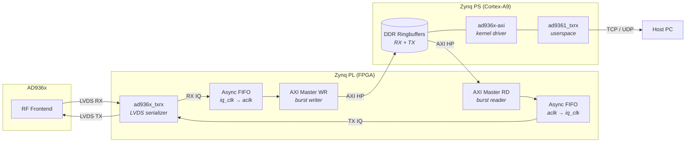

# Zyndra

Zyndra is a custom firmware for a Pluto-SDR clone (Zynq-7020 + AD936x). This is
my take on implementing it from scratch as a learning experience in AD936x,
creating an efficient IQ data pipeline, and processing IQ data on FPGA.

The FPGA design is done from scratch for Zynq-7020 and AD936x chip using Vivado
2024.2.

The Linux is built using Yocto Scarthgap. This is reusing ADI's ad936x kernel
driver. Other parts are implemented from scratch.

## Current status

- Uses ad936x IIO driver for configuring the chip.
- Data bus operates at 1R1T with both RX and TX implemented.
- Custom kernel driver (`ad936x-axi`) manages the DMA ringbuffer in DDR
  reserved memory with cached (write-back) mapping and explicit cache
  invalidation.
- Userspace TCP streaming reaches ~17.5 MSPS. UDP streaming reaches ~11 MSPS.
- An experimental kernel driver (`ad936x-tcp`) streams RX data directly from
  kernel space over TCP, achieving ~18 MSPS at ~50% CPU. It is mutually
  exclusive with `ad936x-axi` and must be loaded manually.
- FPGA bitstream loaded using a service during kernel boot.

## Architecture



## Running instructions

- Login: root (no password)
- IP: 192.168.133.134 (static, configure in
  `yocto/meta-custom/recipes-core/init-ifupdown/files/interfaces`)
- SSH service running
- SD card partitioning (wic image handles this)
  - boot partition (fat)
  - root filesystem (ext4)

### Configuring AD936x

The device tree sets sensible defaults (2.5 MSPS, 2 MHz RF bandwidth, 433.92 MHz
LO, manual gain, -20 dB TX attenuation, bus timing delays). To change at
runtime:

```sh
# Set sampling rate (reconfigures both RX and TX digital chains)
echo 2500000 > /sys/bus/iio/devices/iio:device1/in_voltage_sampling_frequency

# Bus timing delays (set via device tree defaults, override if needed)
echo 0x007 0x08 > /sys/kernel/debug/iio/iio:device1/direct_reg_access  # TX
echo 0x006 0xc0 > /sys/kernel/debug/iio/iio:device1/direct_reg_access  # RX

# RX configuration
echo 2000000 > /sys/bus/iio/devices/iio:device1/in_voltage_rf_bandwidth
echo 433920000 > /sys/bus/iio/devices/iio:device1/out_altvoltage0_RX_LO_frequency
echo manual > /sys/bus/iio/devices/iio:device1/in_voltage0_gain_control_mode
echo 30 > /sys/bus/iio/devices/iio:device1/in_voltage0_hardwaregain

# TX configuration
echo 2000000 > /sys/bus/iio/devices/iio:device1/out_voltage_rf_bandwidth
echo 433920000 > /sys/bus/iio/devices/iio:device1/out_altvoltage1_TX_LO_frequency
echo -20 > /sys/bus/iio/devices/iio:device1/out_voltage0_hardwaregain
```


### Streaming

```sh
# Send RX data out via UDP
ad9361_txrx --rx-udp 192.168.133.1:1234

# Serve RX data out on TCP
ad9361_txrx --rx-tcp 1234

# Receive IQ data from TCP and transmit, TX buffer set to 10 Msamples
ad9361_txrx --tx-tcp 1235 --tx-depth 10

# Simultaneous RX + TX
ad9361_txrx --rx-tcp 1234 --tx-tcp 1235
```

## Building instructions

### Requirements

- Host: Linux with Podman (for Yocto build)
- FPGA tools: Vivado 2024.2
- Hardware: Pluto-SDR clone with Zynq-7020 and AD936x

### Code style checks

```sh
# VHDL
cd fpga
uv run vsg -c vsg_config.yaml --fix

# Run all checks
pre-commit run --all-files
```

### Simulation

The FPGA design has a GHDL-based simulation environment using VUnit. The
testbenches cover:

- `tb_ad936x_txrx` — LVDS serialization/deserialization, RX IQ capture, TX IQ
  output
- `tb_ad936x_axi` — AXI4-Lite register read/write, RX DMA ringbuffer writes,
  TX DMA ringbuffer reads
- `tb_core` — Integration test of the full design core (ad936x_txrx + ad936x_axi
  + AXI masters)

Xilinx primitives (IDDR, ODDR) are replaced with behavioral stubs for GHDL
compatibility. XPM FIFOs and CDC primitives come from the community
[xpm_vhdl](https://github.com/fransschreuder/xpm_vhdl) package.

```sh
cd fpga

# Run all tests
uv run python sim.py

# Run a single testbench
uv run python sim.py ad936x.tb_core.*

# Run with waveform dump
uv run python sim.py --gtkwave-fmt ghw ad936x.tb_core.*
```

### QEMU

A QEMU emulation environment allows running the Yocto Linux image on the host
without hardware. A custom QEMU device (`ad936x_axi`) emulates the FPGA
peripheral register interface and generates synthetic IQ samples via DMA into
guest RAM.

The peripheral logic is implemented in Rust (`fpga/qemu/ad936x-emu/`) and loaded
as a shared library by a thin C shim patched into Xilinx QEMU.

```sh
# Build QEMU (clones Xilinx QEMU, applies patches, compiles)
fpga/qemu/build.sh

# Run (builds Rust library, launches QEMU with the Yocto image)
fpga/qemu/run.sh
```

### FPGA compilation

Uses Vivado 2024.2.

```sh
cd fpga

# Load environment
source /tools/Xilinx/Vivado/2024.2/settings64.sh

# Create Vivado project to `vivado` directory
./create_vivado_project.sh

# Compile
./compile_vivado_project.sh
```

### Yocto

Uses Yocto Scarthgap which is compatible with Vivado 2024.2.

```sh
# Build the container image
yocto/container/build.sh
```

```sh
# Run bitbake in container
yocto/run.sh bitbake core-image-minimal

# A .wic image will appear. Burn it to SD card using `dd` or Balena Etcher
ls -l yocto/build/tmp/deploy/images/zynq-generic/core-image-minimal-zynq-generic.rootfs.wic
```

### Development Flow (TFTP Boot)

After the initial SD card flash, development iterations don't require reflashing.
The target boots kernel, device tree, and initramfs over TFTP from the
workstation.

**Prerequisites:**
- TFTP server on the workstation serving from `/var/lib/tftpboot`
- Network connectivity between workstation and target
- Default configuration assumes TFTP server at 192.168.133.1, target at
  192.168.133.134 (see
  `meta-custom/recipes-bsp/u-boot/u-boot-xlnx/tftp-env.cfg`)

**First time setup:**
1. Flash the wic image to SD card
2. Boot the target, interrupt U-Boot (2-second window)
3. Run `run use_tftpboot` — target reboots into TFTP boot mode

**Daily workflow:**
```sh
# Build and deploy to TFTP server
yocto/build.sh

# Reboot target — it picks up the new build automatically
```

**U-Boot commands** (interrupt autoboot to access):

| Command              | Description                                  |
| -------------------- | -------------------------------------------- |
| `run use_tftpboot`   | Switch to TFTP boot (persists across reboot) |
| `run use_sdboot`     | Switch back to SD card boot                  |
| `run update_boot`    | Update boot.bin and boot.scr on SD via TFTP  |
| `run tftpboot_cmd`   | One-shot TFTP boot without changing mode     |

## Testing

### PRBS

Configure AD936x to PRBS mode

```sh
# Set sample rate
echo 2500000 > /sys/bus/iio/devices/iio:device1/in_voltage_sampling_frequency

# Set PRBS mode
echo 0x3f5 0x40 > /sys/kernel/debug/iio/iio:device1/direct_reg_access
echo 0x3f4 0x09 > /sys/kernel/debug/iio/iio:device1/direct_reg_access

# Set RX bus delays
echo 0x006 0x80 > /sys/kernel/debug/iio/iio:device1/direct_reg_access

# Start transmitting
ad9361_txrx --rx-tcp 1234
```

Run on the host

```sh
cd host/ad936x-tool
cargo run --release -- prbs-check
```

### Loopback PRBS

Configure AD936x to loopback mode

```sh
# Set sample rate
echo 2500000 > /sys/bus/iio/devices/iio:device1/in_voltage_sampling_frequency

# Set RX bus delays
echo 0x006 0xc0 > /sys/kernel/debug/iio/iio:device1/direct_reg_access

# Set TX bus delays
echo 0x007 0x08 > /sys/kernel/debug/iio/iio:device1/direct_reg_access

# Enable digital loopback (register 0x3F5, bit 1 = BIST loopback enable)
echo 0x3f5 0x01 > /sys/kernel/debug/iio/iio:device1/direct_reg_access

ad9361_txrx --prbs
```

### Loopback with TX+RX

1. Host transmits PRBS data to the target
2. Target writes the data to AD936x
3. AD936x loops the data back
4. Target reads the data back from AD936x and transmits to host
5. Host receives the data and verifies the PRBS

Configure the target the same way as the loopback test above (sample rate,
bus delays, BIST loopback bit), then run on the target:

```sh
# Enable both TX and RX
ad9361_txrx --rx-tcp 1234 --tx-tcp 1235 --tx-depth 10.0
```

On the host (two terminals):

```sh
cd host/ad936x-tool

# Terminal 1: stream PRBS into target TX
cargo run --release -- prbs-gen -a 192.168.133.134:1235

# Terminal 2: verify PRBS coming back from target RX
cargo run --release -- prbs-check -a 192.168.133.134:1234
```

## License

This project is licensed under the MIT License — see [LICENSE](LICENSE) for
details.

The AD936x IIO kernel driver (`drivers/iio/adc/ad9361*`) is Copyright (C) Analog
Devices Inc. and licensed under GPL-2.0. See the
[ADI driver source](https://github.com/analogdevicesinc/linux/tree/main/drivers/iio/adc)
for details.
